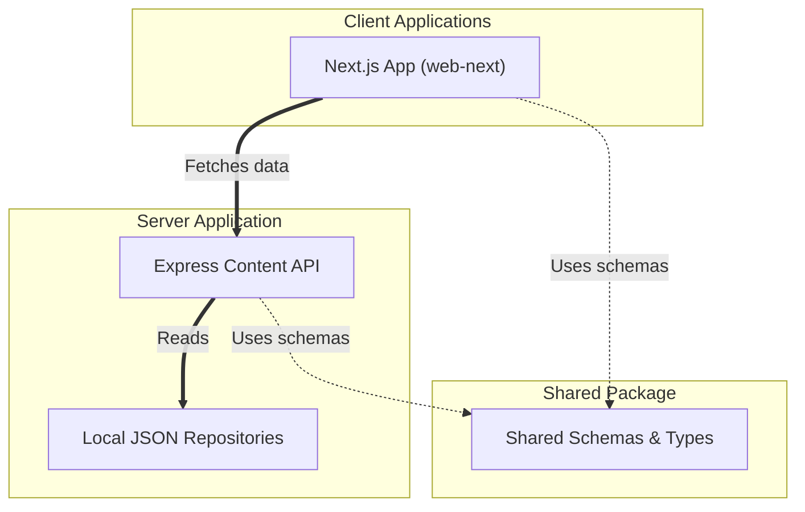

# Mimir Nest

A workspace consolidating academic, learning, productivity, and career planning utilities for college students.

Mimir Nest brings essential student tools together into a unified monorepo. The platform supports seamless offline-first usage through static client-side fallbacks, alongside a local Express server that manages data schemas and validation. This design provides students with accessible utilities without the need to manage fragmented services or rely on multiple disjointed platforms.

## Overview

Mimir Nest provides a single entry point for students to calculate CGPA, run focused study sessions using a Pomodoro timer, practice typing, explore common and advanced portfolio projects, search placement-focused DSA problems, and discover student discounts. 

The architecture is built with user experience, performance, and portability in mind. The web client is designed to load instantly by querying local in-memory caches, falling back to static JSON repositories hosted directly on the client if the Express Content API server is offline.

## Features

### Academic
*   **CGPA Calculator & Analytics** ([cgpa/page.jsx](file:///c:/Users/Sachi/Downloads/gg/frontend-b91c4e81157adae8ee6f786f562cde19b76a0181/apps/web-next/app/cgpa/page.jsx)): Calculate cumulative GPA, estimate future grade requirements, and view analytics on academic performance.
*   **Study Resources**: Direct integration with course lists and structured curricula.

### Learning
*   **Structured Pathways** ([courses/page.jsx](file:///c:/Users/Sachi/Downloads/gg/frontend-b91c4e81157adae8ee6f786f562cde19b76a0181/apps/web-next/app/courses/page.jsx)): Curated course curriculums and learning resources for foundational computer science and engineering.
*   **Structured Roadmaps** ([roadmaps/page.jsx](file:///c:/Users/Sachi/Downloads/gg/frontend-b91c4e81157adae8ee6f786f562cde19b76a0181/apps/web-next/app/roadmaps/page.jsx)): Career and educational learning roadmaps.
*   **Typing Practice Tool** ([typing/page.jsx](file:///c:/Users/Sachi/Downloads/gg/frontend-b91c4e81157adae8ee6f786f562cde19b76a0181/apps/web-next/app/typing/page.jsx)): Typing speed and accuracy testing module.

### Productivity
*   **Pomodoro Focus Timer** ([pomodoro/page.jsx](file:///c:/Users/Sachi/Downloads/gg/frontend-b91c4e81157adae8ee6f786f562cde19b76a0181/apps/web-next/app/pomodoro/page.jsx)): Interactive focus timer with persistent local state configuration and customizable Material You green-theme controls.

### Career
*   **Real-Time Placement DSA Vault** ([placement-dsa/page.jsx](file:///c:/Users/Sachi/Downloads/gg/frontend-b91c4e81157adae8ee6f786f562cde19b76a0181/apps/web-next/app/placement-dsa/page.jsx)): Access up-to-date data structures and algorithms questions categorized by company stats, frequency, and difficulty.
*   **Resume Project Explorer** ([projects/page.jsx](file:///c:/Users/Sachi/Downloads/gg/frontend-b91c4e81157adae8ee6f786f562cde19b76a0181/apps/web-next/app/projects/page.jsx)): Browse and clone common or advanced portfolio-grade projects for engineering resumes.
*   **Student Perks & Discounts Checker** ([email-perks/page.jsx](file:///c:/Users/Sachi/Downloads/gg/frontend-b91c4e81157adae8ee6f786f562cde19b76a0181/apps/web-next/app/email-perks/page.jsx)): Directory of verified student discounts, cloud credits, and utility perks.

## Project Structure

```text
mimir-nest/
├── apps/
│   ├── web-next/                   # Next.js 15 App Router web client
│   │   ├── app/                    # Page routes (cgpa, pomodoro, placement-dsa, etc.)
│   │   ├── components/             # Reusable UI primitives and layout blocks
│   │   ├── public/                 # Static assets, including local JSON content fallbacks
│   │   ├── services/               # API clients and query loaders
│   │   ├── tailwind.config.js      # Green-themed design system configuration
│   │   └── package.json
│   │
│   └── api/                        # Express.js Content API
│       ├── content/                # JSON repositories serving courses, perks, projects, etc.
│       ├── src/                    # API router, validation schemas, controllers, and services
│       ├── .env.example            # Configuration boilerplate
│       └── package.json
│
├── packages/
│   └── shared/                     # Shared workspaces library (schemas, contracts, and types)
│
├── docs/                           # Internal architecture, API, and roadmap documentation
├── LICENSE                         # Project license (MIT)
├── package.json                    # Root scripts & workspaces orchestration configuration
├── pnpm-workspace.yaml             # pnpm workspaces configuration file
└── tsconfig.base.json              # Shared base TypeScript configurations
```

## Architecture

The project leverages a monorepo workspace to coordinate interactions across internal packages and services cleanly.



### Data Pipeline & Hydration Flow
1.  **Shared Workspace Schema Contracts**: All shared properties and models are designed in [`packages/shared`](file:///c:/Users/Sachi/Downloads/gg/frontend-b91c4e81157adae8ee6f786f562cde19b76a0181/packages/shared) so that both client and server reference matching structures.
2.  **API Client & Offline-First Fallbacks**: When rendering pages, [`contentApi.js`](file:///c:/Users/Sachi/Downloads/gg/frontend-b91c4e81157adae8ee6f786f562cde19b76a0181/apps/web-next/services/contentApi.js) uses a cascading fetching strategy:
    *   **Level 1**: Query the customized Next.js API Base URL (`NEXT_PUBLIC_API_BASE_URL`).
    *   **Level 2**: Call the local endpoint (`/api/...`).
    *   **Level 3**: Retrieve files directly from the client public directory (`/content/...`) as an offline fallback if the API is offline.
3.  **Express Content API**: The backend server in [`apps/api`](file:///c:/Users/Sachi/Downloads/gg/frontend-b91c4e81157adae8ee6f786f562cde19b76a0181/apps/api) parses incoming query parameters using `Zod` validation schemas. The server retrieves information from JSON storage repositories in [`apps/api/content`](file:///c:/Users/Sachi/Downloads/gg/frontend-b91c4e81157adae8ee6f786f562cde19b76a0181/apps/api/content), laying the foundation to swap files for database clients later.

## Getting Started

### Prerequisites
*   **Node.js**: Version 18.x or higher
*   **pnpm**: Version 9.x or higher (monorepo package manager)

### Installation
Clone the repository:
```bash
git clone https://github.com/Mimir-nest/mimir-nest.git
cd mimir-nest
```

Install workspace dependencies:
```bash
pnpm install
```

### Running Locally
To launch the Next.js web application (runs on [http://localhost:3000](http://localhost:3000)):
```bash
pnpm dev
```

To run the Express Content API backend (runs on [http://localhost:4000](http://localhost:4000)):
```bash
pnpm dev:api
```

### Build & Compilation
To compile the Next.js client and API backend:
```bash
pnpm build
```

To build components individually:
*   Web App Client: `pnpm build:web`
*   Content API Backend: `pnpm build:api`

### Environment Variables

#### Backend (`apps/api`)
Copy [`apps/api/.env.example`](file:///c:/Users/Sachi/Downloads/gg/frontend-b91c4e81157adae8ee6f786f562cde19b76a0181/apps/api/.env.example) to `.env` in the same directory:
```bash
PORT=4000                             # Port to expose Express server
CORS_ORIGIN=http://localhost:3000     # Allowed cross-origin source URL
CONTENT_DIR=content                   # Relative path containing JSON datasets
VITE_API_BASE_URL=http://localhost:4000
```

#### Frontend (`apps/web-next`)
To bind the Next.js frontend to a dedicated external or local API, create an `.env.local` inside `apps/web-next` containing:
```bash
NEXT_PUBLIC_API_BASE_URL=http://localhost:4000
```

## Development Commands

Execute workspace scripts directly from the repository root:

| Command | Action |
| :--- | :--- |
| `pnpm dev` | Start the Next.js dev server on port 3000 |
| `pnpm dev:api` | Start the Express API server on port 4000 with watch mode |
| `pnpm build` | Build the entire monorepo (both web client & API server) |
| `pnpm lint` | Run ESLint check across all files and packages (`eslint .`) |
| `pnpm typecheck` | Perform static type checks on all apps and packages (`tsc --noEmit`) |
| `pnpm start` | Run production next server for the web client |

## Contributing

We welcome contributions to Mimir Nest. Please refer to [`contributing.md`](file:///c:/Users/Sachi/Downloads/gg/frontend-b91c4e81157adae8ee6f786f562cde19b76a0181/docs/contributing.md) for full style guidelines and code organization details.

### Workflow
1.  Fork the repository and checkout a new branch (e.g. `feature/your-feature-name`).
2.  Make modular changes keeping boundaries clean:
    *   Routing, layouts, and components go to [`apps/web-next`](file:///c:/Users/Sachi/Downloads/gg/frontend-b91c4e81157adae8ee6f786f562cde19b76a0181/apps/web-next).
    *   API endpoints, validation schemas, and services go to [`apps/api`](file:///c:/Users/Sachi/Downloads/gg/frontend-b91c4e81157adae8ee6f786f562cde19b76a0181/apps/api).
    *   Shared TypeScript schemas and interfaces go to [`packages/shared`](file:///c:/Users/Sachi/Downloads/gg/frontend-b91c4e81157adae8ee6f786f562cde19b76a0181/packages/shared).
    *   JSON datasets belong under data folders (`apps/api/content`) and frontend fallback stores (`apps/web-next/public/content`).
3.  Format, lint, and typecheck locally:
    ```bash
    pnpm lint
    pnpm typecheck
    ```
4.  Open a Pull Request with a clear description of the modified scopes.

## Roadmap

Future developments and improvements are cataloged in [`roadmap.md`](file:///c:/Users/Sachi/Downloads/gg/frontend-b91c4e81157adae8ee6f786f562cde19b76a0181/docs/roadmap.md).

*   **In Progress**: Migrate remaining UI/page feature-specific static files to the Express Content API layer.
*   **Planned**:
    *   Introduce category filters and cursor pagination for larger collections.
    *   Replace JSON file repositories with a PostgreSQL database layer while keeping existing frontend API contracts intact.
    *   Implement user authentication (e.g. Auth.js/NextAuth) and build administrator dashboards for content management.

## Platform Philosophy

Mimir Nest is designed to be free student software. We believe utilities for academic tracking, focus improvement, and placement preparation should be accessible to all students without recurring fees, commercial lock-in, or telemetry.

## License

Distributed under the MIT License. See [`LICENSE`](file:///c:/Users/Sachi/Downloads/gg/frontend-b91c4e81157adae8ee6f786f562cde19b76a0181/LICENSE) for more information.

## Status

Mimir Nest is currently in **Early Development**. Features and internal schema interfaces are actively evolving.
