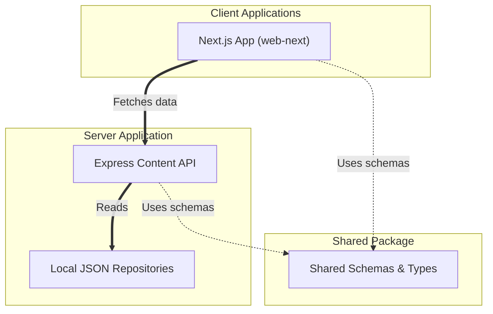

# Mimir Nest Workspace Architecture

This document provides a detailed overview of the system architecture, file structure, and technical components that power **Mimir Nest**.

---

## Architectural Overview

Mimir Nest is structured as a **pnpm monorepo**, separating concerns across a single frontend client, a content delivery API, and shared schemas/packages.



*   **[apps/web-next/](../apps/web-next/)**: The primary frontend client, powered by Next.js 15, styled with Tailwind CSS, and using components from Radix UI and shadcn.
*   **[apps/api/](../apps/api/)**: An Express.js backend that serves static JSON content repositories for courses, roadmaps, placement DSA, and student perks.
*   **[packages/shared/](../packages/shared/)**: Shared TypeScript types, schemas, and contracts shared between the client and the API backend.

---

## File Structure Summary

The primary directory layout and key files:

```
mimir-nest/
├── apps/
│   ├── web-next/                   # Next.js 15 Client
│   │   ├── app/                    # Next.js Page Routes
│   │   │   ├── layout.jsx          # Root Layout config
│   │   │   ├── page.jsx            # Homepage (Bento Grid)
│   │   │   ├── cgpa/               # CGPA Calculators & Analytics
│   │   │   ├── pomodoro/           # Pomodoro Focus Timer
│   │   │   └── placement-dsa/      # DSA Company Vault
│   │   ├── components/             # Components (Home, UI, Pomodoro)
│   │   │   ├── ui/                 # shadcn UI components
│   │   │   └── LanguageSelector.jsx
│   │   ├── tailwind.config.js      # Custom theme configurations
│   │   └── package.json
│   │
│   └── api/                        # Express API Backend
│       ├── src/
│       │   ├── controllers/        # Request handlers
│       │   ├── repositories/       # Content storage interfaces
│       │   └── server.js           # Server start
│       ├── content/                # JSON database files
│       └── package.json
│
├── packages/
│   └── shared/                     # Shared workspaces library
│       └── src/
│           ├── index.js
│           └── content.js
│
├── pnpm-workspace.yaml             # Monorepo workspace configuration
├── package.json                    # Root scripts & configurations
└── README.md                       # Project landing manual
```

---

## Key Technical Layers

### 1. Monorepo Setup
The monorepo leverages `pnpm workspaces` (managed in [pnpm-workspace.yaml](../pnpm-workspace.yaml)).
It orchestrates dependencies efficiently, allowing `apps/web-next` and `apps/api` to reference the common module `packages/shared` locally without publishing packages.

### 2. Next.js 15 Web Client (`web-next`)
*   **Routing**: Implemented inside the folder [apps/web-next/app/](../apps/web-next/app).
*   **State Management**: Handled via `Zustand` with `localStorage` persistence under [apps/web-next/store/](../apps/web-next/store).
*   **Design System & Styling**:
    *   Unified base variables mapped to custom CSS properties in [globals.css](../apps/web-next/app/globals.css).
    *   Design tokens managed inside [tailwind.config.js](../apps/web-next/tailwind.config.js) under a curated brand color theme.
*   **UI Components**: Divided into feature component blocks under [apps/web-next/components/](../apps/web-next/components) and generic primitive building blocks under [apps/web-next/components/ui/](../apps/web-next/components/ui).

### 3. Content API Backend (`api`)
*   **Data Controller-Repository Pattern**: Separates routing from the JSON data ingestion to prepare for an easy swap with databases in the future.
*   **Content Storage**: Files under [apps/api/content/](../apps/api/content) serve as a lightweight file-system database layer.
